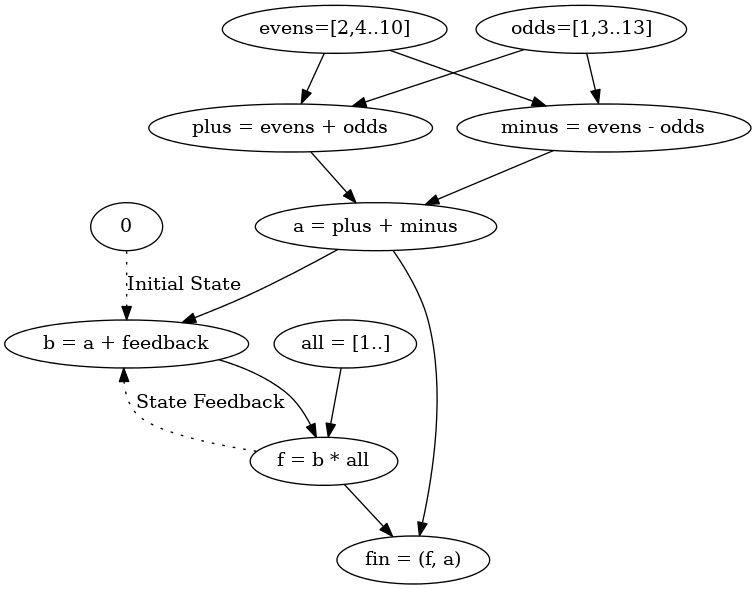

Swiss Arm Knife Converstion Tool
================================

-   Pandoc is can be used to convert between a number of markdown and markup file formats

        Input formats:  docbook, haddock, html, json, latex, markdown,
                        markdown_github, markdown_mmd,
                        markdown_phpextra, markdown_strict, mediawiki,
                        native, opml, org, rst, textile
        Output formats: asciidoc, beamer, context, docbook, docx,
                        dzslides, epub, epub3, fb2, html, html5, icml,
                        json, latex, man, markdown, markdown_github,
                        markdown_mmd, markdown_phpextra,
                        markdown_strict, mediawiki, native, odt,
                        opendocument, opml, org, pdf*, plain, revealjs,
                        rst, rtf, s5, slideous, slidy, texinfo, textile
                        [*for pdf output, use latex or beamer and -o FILENAME.pdf]

Focus
=====

-   markdown
-   html
-   A touch of json
-   Easy of scripting
-   Pandoc was used to make these slides

markdown to html
================

``` {.markdown}
## hi

This is text and [this is a link.](http://www.example.com)
```

``` {.html}
<h2 id="hi">hi</h2>
<p>This is text and <a href="http://www.example.com">this is a link.</a></p>
```

When rendered:

hi
--

This is text and [this is a link.](http://www.example.com)

More
====

``` {.markdown}
## This is a list

* item one
* item two
```

``` {.html}
<h2 id="this-is-a-list">This is a list</h2>
<ul>
<li>item one</li>
<li>item two</li>
</ul>
```

rendered:

This is a list
--------------

-   item one
-   item two

Easy of use
===========

-   Less verbose then html, json, man, opml, epub, etc.
    -   Write in what you know convert to what you do not.
    -   Still recoment markdown ubiquity.
-   Flexible and scriptible
-   Who has the time to learn all of these formats? Epessially if you want content in multiple formats.

Who has the time? markdown -\> html
===================================

``` {.markdown}
## This is a list

* item one
* item two
```

``` {.markdown}
<h2 id="this-is-a-list">This is a list</h2>
<ul>
<li>item one</li>
<li>item two</li>
</ul>
```

Who has the time? markdown -\> asciidoc
=======================================

``` {.markdown}
## This is a list

* item one
* item two
```

``` {.asciidoc}
[[this-is-a-list]]
This is a list
~~~~~~~~~~~~~~

* item one
* item two

```

Who has the time? markdown -\> docbook
======================================

``` {.markdown}
## This is a list

* item one
* item two
```

``` {.docbook}
<sect1 id="this-is-a-list">
  <title>This is a list</title>
  <itemizedlist spacing="compact">
    <listitem>
      <para>
        item one
      </para>
    </listitem>
    <listitem>
      <para>
        item two
      </para>
    </listitem>
  </itemizedlist>
</sect1>
```

Who has the time? markdown -\> latex
====================================

``` {.markdown}
## This is a list

* item one [link](http://www.example.com]
* item two
```

``` {.latex}
\subsection{This is a list}\label{this-is-a-list}

\begin{itemize}
\itemsep1pt\parskip0pt\parsep0pt
\item
  item one {[}link{]}(http://www.example.com{]}
\item
  item two
\end{itemize}
```

Who has the time? markdown -\> json
===================================

``` {.markdown}
## This is a list

* item one
* item two
```

``` {.json}
[{"unMeta":{}},[{"t":"Header","c":[2,["this-is-a-list",[],[]],[{"t":"Str","c":"This"},{"t":"Space","c":[]},{"t":"Str","c":"is"},{"t":"Space","c":[]},{"t":"Str","c":"a"},{"t":"Space","c":[]},{"t":"Str","c":"list"}]]},{"t":"BulletList","c":[[{"t":"Plain","c":[{"t":"Str","c":"item"},{"t":"Space","c":[]},{"t":"Str","c":"one"}]}],[{"t":"Plain","c":[{"t":"Str","c":"item"},{"t":"Space","c":[]},{"t":"Str","c":"two"}]}]]}]]
```

This can represent all of pandoc's internal AST.

Who has the time? markdown -\> etc
==================================

    Output formats: asciidoc, beamer, context, docbook, docx,
                    dzslides, epub, epub3, fb2, html, html5, icml,
                    json, latex, man, markdown, markdown_github,
                    markdown_mmd, markdown_phpextra,
                    markdown_strict, mediawiki, native, odt,
                    opendocument, opml, org, pdf*, plain, revealjs,
                    rst, rtf, s5, slideous, slidy, texinfo, textile
                    [*for pdf output, use latex or beamer and -o FILENAME.pdf]

Scriptablity
============

Since it is easy to out the internal AST it is simple to filter and edit the AST and send it along to other formats.

In fact that is what I have been doing for all of my little converstion examples. I would have been too lazy to copy and paste all of the converstions you have seen so far.

So instead I made a small haskell script to access and filter pandoc AST with command line commands.

Scriptablity CLI
================

``` {.markdown}
 ```{ cmdBlock="pandoc -t html5" inClasses="markdown" outClasses="html5"}
 ## This is a h2 header
 ```
```

becomes:

``` {.markdown}
## This is a h2 header
```

``` {.html5}
<h2 id="this-is-a-h2-header">This is a h2 header</h2>
```

Scriptablity CLI - ls
=====================

``` {.markdown}
 ```{ showCmdBlock="ls -l" outClasses="bashOut"}
 ## This is a h2 header
 ```
```

becomes:

``` {.bash}
$ ls -l
```

``` {.bashOut}
total 2548
-rw-r--r-- 1 pjw users   24725 Jun 11 01:52 20140608-Science-Sunday.html
-rw-r--r-- 1 pjw users    6106 Jun 11 14:15 20140608-Science-Sunday.md
-rw-r--r-- 1 pjw users    3080 Jun 11 14:20 diaExample.svg
-rw-r--r-- 1 pjw users   61550 Jun 11 14:19 dotExample.png
-rwxr-xr-x 1 pjw users    1241 Jun 11 14:19 pandocCmdFilter.hs
-rw-r--r-- 1 pjw users    8926 Jun 11 14:20 README.md
-rwxr-xr-x 1 pjw users 2411446 Jun 11 14:20 tmp
-rw-r--r-- 1 pjw users     681 Jun 11 14:19 tmp.dot
-rw-r--r-- 1 pjw users   17809 Jun 11 14:20 tmp.hi
-rw-r--r-- 1 pjw users     380 Jun 11 14:19 tmp.hs
-rw-r--r-- 1 pjw users   41544 Jun 11 14:20 tmp.o
```

Filters
=======

-   Pattern match on datatype
    -   Paragraph
    -   CodeBlock
    -   BlockQuote
    -   Ordered List
    -   [etc, more at hackage page](http://hackage.haskell.org/package/pandoc-types-1.12.3.3/docs/Text-Pandoc-Definition.html#t:Block)
-   Then transform and preform IO actions to create a new Block datatype.

Command Line Filter
===================

To inport a file with highlighting:

``` {.markdown}
 ```{ cmdBlock="cat pandocCmdFilter.hs" outClasses="haskell"}
 ```
```

``` {.haskell}
#!/usr/bin/env runhaskell
-- behead2.hs
import Text.Pandoc.JSON

import System.Process

import Data.Monoid
import Data.List (find)

main :: IO ()
main = toJSONFilter handleCmds

handleCmds :: Block -> IO Block
handleCmds (CodeBlock (ident, [] , (("showCmdBlock",cmd0):attrs)) code) = do
    cmdBlock <- handleCmds $ CodeBlock (ident, [], (("cmdBlock",cmd0):attrs)) code
    return $ Div ("", ["groupCodeBlock"], [])
                 [ CodeBlock (ident, ["bash"], []) $ "$ " <> cmd0
                 , cmdBlock
                 ]
handleCmds (CodeBlock (ident, [] , (("cmdBlock",cmd0):attrs)) code) = do
    let (cmd:args) = words cmd0
    let outClasses =
              words
            . maybe [] snd
            . find ((== "outClasses") . fst)
            $ attrs
    let inClasses =
              words
            . maybe [] snd
            . find ((== "inClasses") . fst)
            $ attrs
    let inputBlock =
            if null code
            then Null
            else CodeBlock (ident, inClasses, []) code
    result <- readProcess cmd args code
    return $ Div ("", ["groupCodeBlock"], [])
                 [ inputBlock
                 , CodeBlock (ident, outClasses, []) result
                 ]
handleCmds x = return x

```

GraphViz - Inline dot files
===========================



Inline Diagrams Code
====================

``` {.haskell outFile="./diaExample.svg"}
{-# LANGUAGE NoMonomorphismRestriction #-}
import Diagrams.Prelude
import Diagrams.TwoD
import Diagrams.Backend.SVG
import Data.List

example = hrule (2 * sum sizes) === circles # centerX
  where circles = hcat . map alignT . zipWith scale sizes
                $ repeat (circle 1)
        sizes   = [2,5,4,7,1,3]

main = renderSVG "diaExample.svg" (Width 500)  (example # lw 0.2)
```


Easy of use + Scriptablity
==========================

-   Pleanty of examples of scriptin Pandoc in:
    -   Haskell
    -   Python
    -   Perl
    -   others
    -   If you can handle JSON you can script Pandoc
-   Go forth and create and customize.
